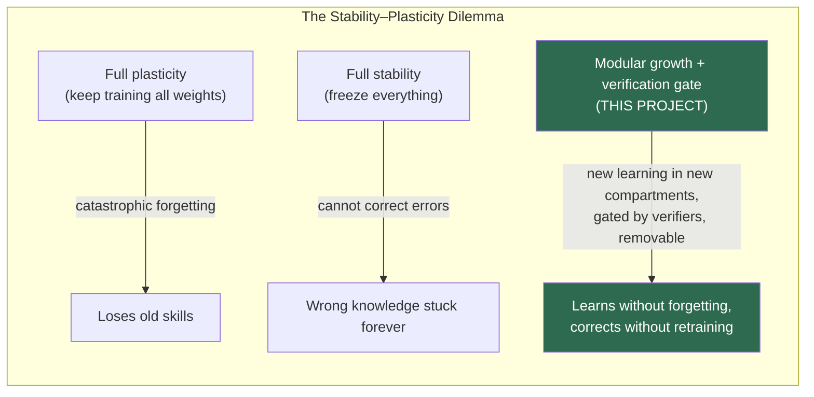
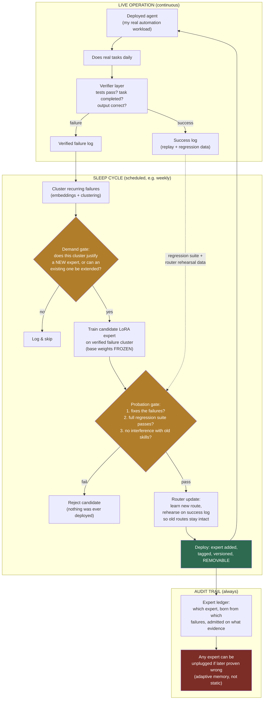
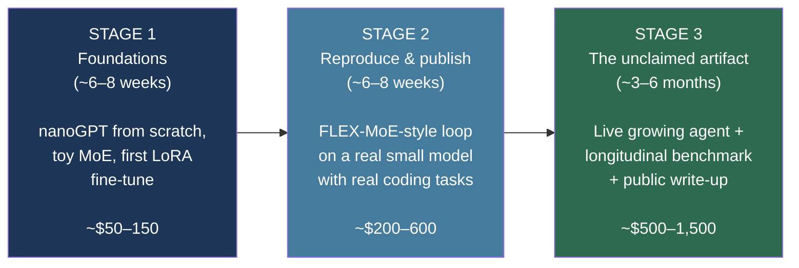
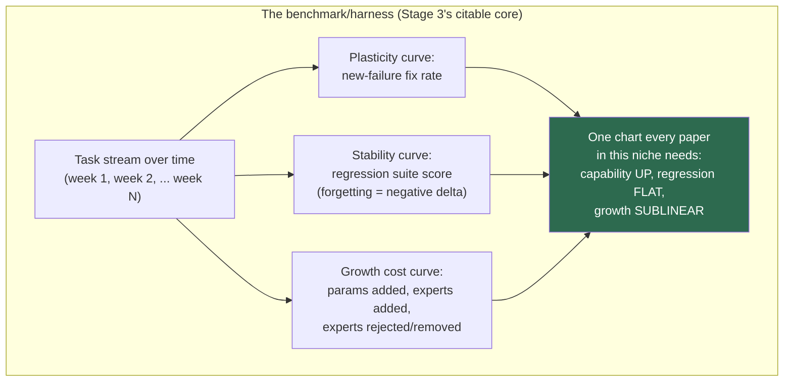

# Project Plan: The Growing Model
### A continually-learning MoE system with verified expert admission

**Status:** First real vertical slice implemented — created 2026-07-30, build started 2026-07-31
**Author:** Brenden
**Working title options:** Grove (experts that grow), Arbor, ExpertGarden — pick one later, it doesn't matter yet.

## Implementation update — 2026-07-31

The project name is now Grove, and the first narrow Stage 2-style real-model vertical slice was completed earlier than this original roadmap anticipated.

Completed:

- deterministic end-to-end control-plane demonstrator;
- SQLite evidence store and append-only expert/deployment ledger;
- auditable external routing and failure-family clustering;
- demand, birth-task, held-out, plasticity, and routed-replay gates;
- dedicated Apple MLX worker on a 24 GB M4 Mac Mini;
- frozen Qwen2.5-Coder 1.5B 4-bit base and isolated LoRA candidates;
- 20 verified training failures, four holdouts, four regressions, and two future tasks;
- fresh networkless LXD execution for generated Python;
- three rejected real candidates followed by one admitted 2.64M-parameter expert;
- longitudinal baseline/growth/rollback measurements;
- artifact hashing, exact base snapshot pinning, rollback, restoration, and security tests.

Observed final result:

- birth-task fixes: 18/20;
- held-out improvement: 0/4 to 3/4;
- regression benchmark: unchanged at 2/4;
- aggregate benchmark: 25.0% to 62.5%;
- harder future tasks: 0/2;
- training time: 34.82 seconds on the M4 worker;
- full automated suite: 25/25 tests passed.

Still outstanding from the long-term plan:

- a larger regression/replay corpus;
- a genuine second cycle with another independently trained expert;
- learned or embedding-based routing with route metrics;
- naive fine-tuning and multi-seed research controls;
- resumable scheduling, monitoring, backups, and production operations;
- a 90-day longitudinal run on real arriving workloads.

The authoritative detailed record is `docs/EXPERIMENT_REPORT_2026-07-31.md`. Exact byte-for-byte copies of the original `README.md` and `PLAN.md` from commit `86c3f53` are indexed in `docs/ORIGINAL_FILES.md`. The remainder of this document is the original plan and should be read as historical intent, not current implementation status.

## Verification and open-questions update — 2026-08-01

The 2026-07-31 result was independently verified (`docs/VERIFICATION_2026-08-01.md`, probe code in `scripts/independent_probe.py`). Summary: nothing was fabricated; the 0/4 -> 3/4 holdout result reproduces exactly; six brand-new holdouts written after admission scored 0/6 (base) -> 5/6 (adapter), which is cleaner transfer evidence than the original holdouts because they could not have influenced candidate selection; but forcing the adapter on out-of-family tasks broke `reg_dedupe`, a task the base solves, proving the zero-forgetting result comes from router shielding rather than adapter harmlessness.

That verification, plus a review of the claim structure, produces the ranked list of what still must be tested before the core theory — *a frozen model continually improving through verified-failure-born, removable experts* — can be called demonstrated:

1. **Self-generated corrections (biggest gap).** The admitted expert trained on human-written canonical solutions; the model's failures only selected what to train on. The decisive experiment: on failure, have the model produce candidate fixes itself (retry with verifier feedback, best-of-N filtered by the sandbox) and train only on verified self-corrections. If that yields an admissible expert, "learning from its own failures" becomes literal.
2. **Second and Nth cycles with coexisting experts.** One expert proves nothing about accumulation. Train a second expert from the same frozen base on a different family, then measure: inter-expert interference, router precision/recall with a growing pool, and whether the longitudinal capability curve keeps rising.
3. **Forgetting measured against the adapter, not the deployment.** Replay suites must run with each expert forced on (not just routed), over 50–100 diverse stable behaviors, because the router will not always shield correctly as routes broaden or become learned.
4. **Transfer beyond paraphrases.** `path_rename`/`path_project` remain unsolved. Show that a later cycle — new live failures, new corrections, a new expert — captures what the first cycle could not.
5. **Research controls.** Multiple seeds, predeclared thresholds, fresh per-cycle holdouts never used by gates, confidence intervals, and a naive full-fine-tune control on identical data.
6. **Beyond deterministic verifiers.** The loop currently requires executable hidden test cases. Whether admission gates survive noisier verification (LLM judges, human feedback, task-completion signals) is untested and bounds the theory's domain.
7. **Persistent serving and the live-agent question.** The current MLX worker cold-loads the base model per job — an implementation choice, not an architectural requirement, since the base is never modified. Required experiment: a resident-base inference server with hot-attachable LoRA adapters (multi-LoRA serving in the style of vLLM/LoRAX/S-LoRA). Measure: cold vs. warm latency, adapter attach time (~10.6 MB per expert; memory growth is linear but trivial, and cold experts can page from SSD), and the one real UX cost — KV-cache invalidation when the router switches adapters mid-conversation, forcing a re-prefill. Admitting a new expert should be a pool insert with zero downtime, never a rehost.

---

## 1. The idea in one paragraph

Today's LLMs are frozen the day training ends. All continual-learning research solves one piece of the problem in isolation, on toy benchmarks. **This project builds the assembled loop as a real, running system**: a deployed agent that does real work, captures its own *verified* failures, periodically grows a new vetted expert to fix them (leaving all existing weights frozen and untouched), updates its router, and demonstrably improves month over month **without regressing** — with every added expert removable if it later proves wrong. The deliverables are (1) an open-source working pipeline, (2) a longitudinal evaluation harness/benchmark that the niche currently lacks, and (3) a public write-up with real improvement curves from months of live operation.

**Why me:** the hard part of this is not exotic ML — it's orchestration: agents, verification harnesses, automated eval gates, scheduled jobs, monitoring. That's systems/agentic engineering (my existing skill set) wrapped around fine-tuning machinery (learnable in weeks). The incumbents (academic labs) are strong at the half I need to learn and weak at the half I already know.

---

## 2. Background: why this gap exists

### The core problem: catastrophic forgetting
Neural network weights are one shared canvas. Training on new experience paints over old knowledge. This is why no frontier lab ships a model that keeps learning after release — they batch-retrain every few months instead.

### The fix everyone is circling: modular growth
Don't repaint the canvas — add compartments. Freeze the base model, add new experts/adapters for new learnings, teach the router about them. Forgetting becomes impossible by construction; wrong learnings become *removable* (unplug the expert) instead of smeared permanently across billions of weights.

### The stability–plasticity dilemma (the tension every design negotiates)

### What 2026 research has already built (one piece each, toy scale)

| Paper | The piece it contributes | Link |
|---|---|---|
| **FLEX-MoE** (Jan 2026) | Failure capture: frozen base logs its own *verifier-checked* failures, clusters them, trains one removable LoRA expert per cluster, born orthogonal to existing activations | https://doi.org/10.2139/ssrn.6978498 |
| **Grow-on-Demand / GoD-MoE** (AAAI 2026) | The demand gate: an "Expert Demand Detector" decides whether a new expert is actually needed or existing ones can stretch | https://ojs.aaai.org/index.php/AAAI/article/view/40077 |
| **CP-MoE** (May 2026) | The staging area: a "transient expert" absorbs unstable early learning, then guides careful integration into the stable pool | https://arxiv.org/html/2605.20247 |
| **BAR: Branch-Adapt-Route** (Apr 2026, AI2/UW/Berkeley) | Modular composition: train domain experts independently (each with own SFT+RL), compose via MoE with lightweight router training, update experts independently | https://doi.org/10.48550/arxiv.2604.18473 |
| **Brainstacks** (Apr 2026) | Frozen adapter stacks composing additively on a frozen base; residual boosting (new stacks learn what old stacks missed) | https://arxiv.org/pdf/2604.01152 |
| **LLaVA-CMoE** | Probe-guided expansion without replay data, multimodal | https://openreview.net/pdf?id=caDjycqDY2 |

**The gap:** nobody has welded these into one running system on real work, and there is **no standard longitudinal benchmark** for "does a growing model improve over weeks without regressing?" Every paper measures forgetting differently on different toy tasks. Both the system and the benchmark are unclaimed.

---

## 3. Target system architecture (Stage 3 end-state)

Key design principles (from the conversation that spawned this):
1. **Verification is the gatekeeper of permanence.** Only verified lessons get consolidated. This is the answer to "what if what it learned is the wrong way?"
2. **Freezing prevents forgetting AND prevents correction** — so correction happens by *removal/replacement* of modular experts, never by editing frozen weights.
3. **The router is the danger zone.** Router updates touch shared weights → always rehearse with replay from the success log. Misrouting = forgetting without touching a single old weight.
4. **This mirrors biology:** fast editable memory (logs) during the day → verified consolidation into structure (experts) during "sleep." Sleep-time compute, made of cron jobs.

---

## 4. Three-stage roadmap

### Stage 1 — Earn low-level fluency (weeks 1–8, nights/weekends)

| Week | Work | Deliverable |
|---|---|---|
| 1–2 | Karpathy "Neural Networks: Zero to Hero" — micrograd (backprop by hand), makemore (embeddings, MLPs). Non-negotiable: this is where concepts become muscle memory. | Working micrograd + makemore notebooks |
| 3–4 | Build and train **nanoGPT** on a small dataset. Read "Attention Is All You Need" + The Illustrated Transformer alongside. Rent a single GPU (~$0.50–3/hr) for the training runs. | A tiny GPT I trained myself; loss curves I can explain |
| 5 | MoE fundamentals: read DeepSeekMoE paper + a makeMoE-style tutorial. **Implement a toy MoE layer with a top-k router inside my nanoGPT** — build the receptionist myself. | nanoGPT-MoE fork; watch experts specialize (or collapse — instructive either way) |
| 6–7 | First real fine-tune: LoRA on a 1–3B open model (Qwen2.5-1.5B / Llama-3.2-3B) using **Unsloth or Axolotl**, training on a curated slice of the Kimi K2.5 distilled reasoning dataset (Jackrong/Kimi-K2.5-Reasoning-1M-Cleaned on HF). Evaluate before/after with **lm-evaluation-harness**. | A measurably improved small model + before/after eval table |
| 8 | Write-up #1 (blog post): "From agentic coding to training my first model." Set up the public repo. Begin building in public. | Published post + repo skeleton |

### Stage 2 — Reproduce the loop, on real tasks (weeks 9–16)

Goal: rebuild the FLEX-MoE-style failure-born expert loop on an open model, but with **real agent coding tasks** (my home turf) instead of arithmetic benchmarks.

1. **Base:** frozen Qwen2.5-1.5B-Instruct or Llama-3.2-3B-Instruct.
2. **Verifier tasks:** coding problems with deterministic test suites (unit tests = perfect verifier). Generate/curate a few hundred; hold out a regression suite the base model already passes.
3. **Failure capture:** run the agent, log verified failures with full context.
4. **Cluster:** embed failure traces, cluster (k-means / HDBSCAN) to find recurring failure modes.
5. **Grow:** train one LoRA expert per major cluster on verified corrections (self-generated then verified, or distilled from a big model via API).
6. **Route:** start simple — a lightweight classifier that picks which adapter (if any) to activate per request. PEFT multi-adapter / X-LoRA-style routing. Simple beats clever here.
7. **Measure (this is the part that matters):**
   - Plasticity: % of target failures now fixed
   - Stability: regression suite delta (must be ≈ 0)
   - Control: compare vs. naive fine-tuning of the base (show ITS regression)
8. **Release:** repo + write-up #2, including everything that didn't work. Honest reproductions with public code out-impact the originals.

### Stage 3 — The artifact nobody has (months 5–9)

1. Wire the loop into one of my **actual production automation agents**.
2. **Sleep cycles:** scheduled (weekly) consolidation runs — capture → cluster → demand gate → train → probation gate → router rehearsal → deploy. All automated; this is a pipeline, and pipelines are my job.
3. **The benchmark** (the citable contribution): a longitudinal eval harness — tasks arriving over time, tracking per-week curves of plasticity, stability/forgetting, and net capability. Name it, document it, release it standalone so other papers can adopt it.
4. Run for **90+ days**. Publish: code + benchmark + write-up (arXiv preprint) with real curves: "a model that has been continuously learning in production for 90 days, without regression, with an auditable expert ledger."

---

## 5. Budget & resources

| Item | Est. cost |
|---|---|
| Stage 1 GPU rental (single GPU, spot hours) | $50–150 |
| Stage 2 GPU rental (training LoRA experts, eval runs) | $200–600 |
| Stage 3 (recurring weekly sleep-cycle training + eval, 3–6 months) | $500–1,500 |
| API calls for distilled corrections (optional, Stage 2–3) | $100–500 |
| **Total, worst case** | **~$2,750** |

GPU price reference (July 2026): H200 ~$2.60–4/hr, B200 ~$3.70–5/hr on budget clouds; 1–3B-model work fits on far cheaper cards (a single A100/4090-class rental).

---

## 6. Risks — honest version

| Risk | Reality check | Mitigation |
|---|---|---|
| **Scooped** — the field is visibly heating up in 2026; a lab ships this within a year | Real. Speed matters. | Build in public from week 1 (priority is established by publishing, not finishing); ship Stage 2 write-up even if imperfect |
| **Toy-scale dismissal** — "cute, but it's a 1.5B model" | Partially valid | Real production tasks + longitudinal data is what labs *don't* have; that is the differentiator, lean on it |
| **Eval contamination** — training on things the regression suite tests | Would invalidate everything | Strict train/eval separation from day 1; decontamination checks; publish the split |
| **Router forgetting** — the known hard part | The single biggest technical risk | Keep the router deliberately dumb (external classifier over adapters) until forced otherwise; always rehearse with replay |
| **Time** — nights-and-weekends for most of a year | The actual price | Stage gates: each stage produces a standalone publishable artifact, so quitting early still yields value |
| **Stage 1 feels slow while ambition sprints** | It will | Remember: the gap is systems × ML; Stage 1 is buying the ML half. 8 weeks is cheap for that |

**Success calibration:** recognition = GitHub stars, citations in the niche, researchers reaching out — not a NeurIPS spotlight on attempt one. The benchmark is the most likely citation magnet.

---

## 7. Reading list

**Foundations (Stage 1):**
- Karpathy — Neural Networks: Zero to Hero (videos) + nanoGPT repo
- "Attention Is All You Need" + Jay Alammar's Illustrated Transformer
- DeepSeekMoE paper (fine-grained experts); DeepSeek-V2 (MLA)
- Kimi K3 tech report — arXiv:2607.24653 (the paper that started this whole thread; re-read after Stage 1 and see how much more it makes sense)
- Sebastian Raschka — Kimi K3 Architecture Notes + LLM Architecture Gallery

**The niche (Stage 2+):** the six papers in the table in §2, FLEX-MoE first.

**Tools:** Unsloth / Axolotl (fine-tuning), PEFT (multi-adapter), lm-evaluation-harness (evals), vLLM (serving), HF datasets: `Jackrong/Kimi-K2.5-Reasoning-1M-Cleaned`, `greghavens/kimi-k3-coding-and-debugging-traces` (also study its *moonshiner* harness — verification-first trace collection, same philosophy as this project).

**Context from the conversation that produced this plan (2026-07-30):** Kimi K3 deep-dive → MoE routing/pruning → continual learning → "extra storage for new experts" idea → discovery that 2026 papers (FLEX-MoE, GoD-MoE, CP-MoE, BAR) each built one piece → gap identified: nobody has welded the loop into a live system, and no longitudinal benchmark exists.

---

## 8. Next actions

- [ ] Pick a project name and create the public GitHub repo (empty is fine — building in public starts now)
- [ ] Week 1: start Zero to Hero, micrograd video 1
- [ ] Create a rented-GPU account (RunPod / Lambda / similar) and run one hello-world training job
- [ ] Skim FLEX-MoE end to end once now (won't fully land yet — that's fine, re-read after Stage 1)
- [ ] Calendar block: recurring weekly hours for this, treated as immovable
