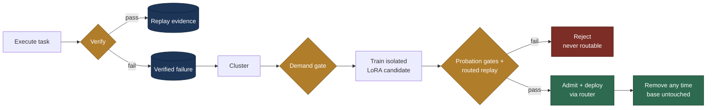
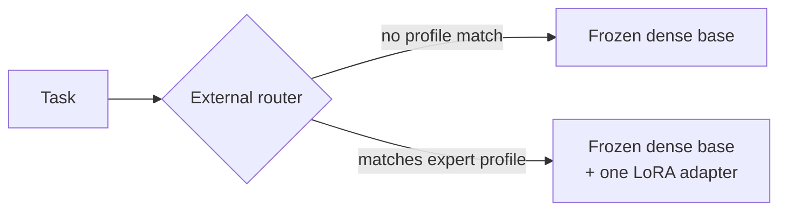

# Grove

Grove is a control plane for agents that grow new, removable experts from verified failures without changing the frozen base model.

In plain terms: the agent runs tasks against a frozen model; every failure is verified and recorded; recurring failures are clustered; when a cluster carries enough verified corrections, a small LoRA adapter is trained on them in isolation; the candidate must pass a battery of admission gates before a router will ever send it traffic; and an admitted expert can be removed in one step without touching the base model or any other expert.



Every decision is persisted to SQLite. A failed candidate never becomes routable. An admitted expert can be unplugged without editing the base or any other expert.

Two complete backends are included. The deterministic CPU demo exercises the lifecycle quickly. The real vertical slice runs a frozen 4-bit Qwen2.5-Coder 1.5B model on Apple MLX, trains isolated LoRA adapters from verified coding failures, and executes model-written Python only inside fresh networkless LXD containers.

## The story so far

Five sealed real-model experiments have been executed. One produced a positive but narrow, router-dependent result; an independent verification both strengthened and undercut it; one falsified a core hypothesis; two measured a hard zero on self-repair; and the latest falsified two-expert coexistence when the router claimed base-passing traffic for the second candidate. Each is diagrammed in detail in the [visual guide](docs/VISUAL_GUIDE.md).
For the measured record and its limits, read the [public results summary](docs/RESULTS.md). The repository is released under the [MIT License](LICENSE).

```mermaid
flowchart TB
    E1["2026-07-31 — First real growth cycle<br/>ADMITTED: one 2.64M-parameter LoRA expert after three rejections<br/>held-out 0/4 → 3/4, clean manifest-only rollback and restore"]
    V1["2026-08-01 — Independent verification<br/>REPRODUCED: hashes, ledger, and 0/4 → 3/4 check out exactly;<br/>fresh post-admission holdouts 0/6 → 5/6.<br/>BUT the adapter forced on breaks a task the base solves"]
    E2["2026-08-08 — EXP-002: replay without the router shield<br/>H3 FALSIFIED: forced-adapter regression 46/94.<br/>Stability is router shielding, not adapter retention.<br/>Routed replay 94/94; route precision and recall 1.0"]
    E3["2026-08-08 — EXP-003: can the model write its own corrections?<br/>UNUSABLE (exit 2): 0/20 verified self-repairs<br/>under 3 greedy attempts per failure; no expert, arms unpairable"]
    E4["2026-08-09 — EXP-004: self-repair under a fair sampled regime<br/>UNUSABLE (exit 2): 0/20 verified in 160 seeded sampled calls;<br/>control arm verified 20/20 and admitted an expert"]
    E5["2026-08-11 — EXP-005: second cycle, two-expert coexistence<br/>H1+H2 FALSIFIED (exit 1): candidate met every competence bar<br/>(target 17/20, held-out 3/4) but the router claimed 18/112<br/>base-passing tasks (FP 0.161), 12 regressed routed; rejected.<br/>Final pool: one expert, capability delta 0.0"]

    E1 --> V1 --> E2 --> E3 --> E4 --> E5

    classDef pos fill:#2d6a4f,color:#fff,stroke:#183b2c
    classDef mixed fill:#b07d2b,color:#fff,stroke:#704c14
    classDef neg fill:#7b2d26,color:#fff,stroke:#4d1713
    class E1 pos
    class V1 mixed
    class E2,E3,E4,E5 neg
```



What this adds up to: the control plane — capture, gating, training, admission, routing, removal, audit, sealed specs — works and refuses bad evidence, including a competent candidate whose deployment would have regressed live traffic. The scientific thesis, that an agent can safely accumulate skills this way, is not proven, and the strongest recent measurements point against three of its pillars: stability is router shielding rather than adapter-intrinsic retention, this base model has produced zero verified self-corrections in 220 attempts across two regimes, and the first attempt at two coexisting experts was falsified by router over-claiming (precision 0.143 against the deployed pool). The precise claims and non-claims are in [Current boundary](#current-boundary).

## Routing: not MoE, and not in front of one

A common first read of "experts plus a router" is that Grove adds experts to a Mixture-of-Experts model, or stacks its router in front of one. Neither is true. The base is Qwen2.5-Coder 1.5B, a **dense** model with no internal router. Grove's "experts" are whole LoRA adapters, and its router is an external dispatch layer that sits in front of the **model**, not in front of another router.

| | MoE (inside the model) | Grove (outside the model) |
|---|---|---|
| Expert | A feed-forward sub-layer, trained jointly | A standalone LoRA adapter, trained in isolation |
| Router | Learned gating network inside the forward pass | External tag/keyword/profile classifier (`src/grove/routing.py`) |
| Decision | Per token, per layer, mixing several experts | Once per request: attach one admitted adapter or none |
| Reversibility | Experts are woven into shared weights | An expert is a ~10 MB file; removal is a manifest edit |



The router is deliberately dumb: each admitted expert declares narrow tags and keywords, and routing is an interpretable score over them. A learned embedding classifier can replace it behind the same `route(task, experts)` seam, but any replacement's proposed update must still survive routed replay before deployment.

This design choice is load-bearing in the results, in both directions. EXP-002 showed the deployed system's stability **is** the router: forced past it, the admitted adapter regressed 46/94 prior-passing tasks. EXP-005 showed the router is also the current bottleneck: a second candidate passed every competence gate but was rejected because tag/keyword routing claimed 18/112 tasks the base already solved. The falsified component in both is routing, not the adapters or the gates.

## Run the complete loop

Requires Python 3.11+ and [uv](https://docs.astral.sh/uv/).

```bash
uv run grove --db .grove/demo.db demo --reset
uv run grove --db .grove/demo.db status
uv run grove --db .grove/demo.db curve
uv run grove --db .grove/demo.db ledger
```

The expected curve is:

| Checkpoint | Capability | Plasticity | Stability | Forgetting (routed) | Active experts |
|---|---:|---:|---:|---:|---:|
| baseline | 57% | 0% | 100% | 0% | 0 |
| after growth | 100% | 100% | 100% | 0% | 1 |

The forgetting column is **routed**: it measures the deployed system, where the
router keeps replay prompts away from the expert. The same demo expert records
`forced_regression_rate: 1.0` with the adapter forced on, so its recorded
`forgetting_claim` is `router_shielded`, not `adapter_intrinsic`. See the
[experiment protocol](docs/EXPERIMENT_PROTOCOL.md).

Run the safety suite:

```bash
uv run --extra dev pytest
```

The tests cover failure capture, demand gating, successful admission, rejection of a regressive router update, split governance, inference stop boundaries, audit events, expert removal, and real LXD isolation.

## First real experiment result

The 2026-07-31 experiment completed successfully after three rejected candidates and one admitted candidate:

| Metric | Frozen baseline | Admitted expert | Rollback |
|---|---:|---:|---:|
| Held-out escaped-path tasks | 0/4 | 3/4 | 0/4 |
| Regression tasks | 2/4 | 2/4 | 2/4 |
| Aggregate capability | 25.0% | 62.5% | 25.0% |
| Deployed experts | 0 | 1 | 0 |

The admitted 2.64M-parameter LoRA expert fixed 18/20 corrected failures, met the 75% held-out gate, caused no measured replay regression, and was removed and restored through append-only deployment manifests. It did not solve the two harder future algorithms.

Read [the complete experiment report](docs/EXPERIMENT_REPORT_2026-07-31.md) for every attempt, defect, repair, metric, limitation, and artifact hash.

### Independent verification (2026-08-01)

The result was independently re-verified after the fact ([full verification report](docs/VERIFICATION_2026-08-01.md)):

- all artifact hashes, ledger events, and machine claims check out, and the 0/4 -> 3/4 holdout result reproduces exactly under re-execution;
- on **six brand-new holdouts created after admission** (which therefore could not have influenced candidate selection), the adapter scored **5/6** against the base's 0/6 — stronger evidence of within-family transfer than the original gate-tainted holdouts;
- however, with the adapter **forced on** (bypassing the router), it breaks `reg_dedupe`, a task the base solves — so the zero-forgetting result is a property of router shielding, not of the adapter itself. The probe is reproducible via `scripts/independent_probe.py`.

## Run the real MLX experiment

> `REAL_CYCLE_POLICY` declares a 50-task prior-passing replay cohort, and a
> capacity preflight rejects any run whose catalog cannot supply it before the
> sandbox or the worker is touched. The 50-task cohort has since been authored
> (`coding_catalog()` now carries 123 captured tasks), which is what let the
> 2026-08-08 EXP-002 rerun and EXP-003 run execute. See the
> [experiment protocol](docs/EXPERIMENT_PROTOCOL.md).

The checked-in deployment assumes the provisioned worker `grove-worker@grove-worker-1` and the dedicated key at `~/.ssh/grove_worker`. A real cycle must name the sealed spec it is being run under, so the report records which declaration it was launched against:

```bash
scripts/preflight.sh
uv run grove \
  --db /srv/storage/grove/grove-real-next.db \
  real-cycle --reset \
  --spec experiments/EXP-002-forced-replay-and-route-precision.json \
  --arm primary \
  --report /srv/storage/grove/evaluations/real-cycle-next.json
```

Omitting `--spec` produces an unbound report, which `scripts/check_experiment_spec.py` refuses to grade (exit 2). `--arm` names which of a paired spec's setup profiles the run must satisfy; EXP-003's canonical control needs `--arm control`.

Everything that can refuse for free refuses first: the spec seal, then a pure preflight (correction source, self-repair attempts, spec substance, setup schema, arm name, timing claim), then arm setup conformance, then replay capacity. Only after all four does the run create a database, a container, or an SSH connection.

The experiment uses four immutable data roles: 20 live failure/correction prompts for training, four held-out prompts for admission, four regression prompts, and two future-stream prompts. Expected outputs stay in the host verifier and never enter model prompts. Adapter training runs on grove-worker-1's Mac; control-plane state, datasets, artifacts, and reports live under `/srv/storage/grove` on Agentbox.

Use fresh paths. `--reset` replaces the exact selected database. See the [runbook](docs/RUNBOOK.md) before reproducing or extending the experiment.

## Predeclared experiments

| Spec | Question | Status |
|---|---|---|
| [`EXP-002`](experiments/EXP-002-forced-replay-and-route-precision.json) | Does a grown expert preserve prior competence without the router shield? | **Executed 2026-08-08 (rerun): H3 falsified** — forced regression 46/94; stability is router-shielded, not adapter-intrinsic |
| [`EXP-003`](experiments/EXP-003-correction-source-ab.json) | Can the model supply its own verified corrections? | **Executed 2026-08-08: unusable (exit 2)** — self-repair 0/20 verified under greedy triple-identical attempts, no primary expert, arms unpairable ([research note](research/2026-08-08-exp003-ab.md)) |
| [`EXP-004`](experiments/EXP-004-fair-self-repair-ab.json) | Does self-repair work under a fair regime (8 sampled, seeded attempts with honest verifier feedback)? | **Executed 2026-08-09: unusable (exit 2)** — self-repair 0/20 verified in 160 sampled calls (temp 0.8, seeds recorded); control 20/20 with an admitted expert; arms unpairable ([research note](research/2026-08-09-exp004-fair-self-repair.md)). Sealed digest `f129e49a…795dd5`; thresholds (verified rate ≥ 0.25, justified in the sealed background) were declared before the run |
| [`EXP-005`](experiments/EXP-005-second-cycle-coexistence.json) | Can a second expert grow on a new failure family (`path_restructure`) while the first stays deployed — without router confusion, interference with expert 1, or capability regression? | **Executed 2026-08-11: H1+H2 falsified (exit 1)** — the candidate met every competence gate (target 0.85, held-out 0.75, recall 1.0) but the router claimed 18/112 base-passing replay tasks (FP rate 0.161 vs budget 0.0) and 12 regressed routed (0.107 vs 0.0); the unchanged admission policy rejected it. Final pool: one expert; capability delta cycle 2 exactly 0.0; expert 1's routed/forced held-out both held at 0.75; 23/29 rules passed, 6 failed ([research note](research/2026-08-11-exp005-second-cycle.md)) |

A sealed-and-pending spec proves only which declaration a future report will be
bound to; it is not a result and not a timestamp.

## What is real versus simulated

Real in the current build:

- immutable task and verification evidence;
- SQLite operational state and append-only expert ledger;
- verifier registry (`exact`, `numeric`, and structural `json`);
- auditable external routing with inactive experts excluded by construction;
- recurring-failure clustering and minimum-evidence demand gate;
- isolated candidate state;
- target-fix, plasticity-gain, and routed-replay regression gates;
- admission, rejection, failure resolution, and one-step removal;
- longitudinal capability, plasticity, stability, forgetting, expert-count, and parameter-growth checkpoints;
- a backend-independent Python API;
- SSH job isolation under a dedicated non-admin macOS account;
- MLX-LM QLoRA training and adapter-aware inference;
- immutable dataset roles with content-hash leakage rejection;
- host-held Python cases executed in disposable LXD containers;
- artifact hashes, deployment manifests, rollback drills, and future-stream probes.

Simulated in the included demo:

- model inference;
- expert training;
- embedding-quality clustering.

The deterministic demo still simulates inference, training, and semantic clustering so the control plane remains testable without Apple hardware. The real experiment replaces inference and training with MLX and verification with LXD; clustering remains explicit failure-family grouping for this narrow workload.

## Documentation

| Document | Purpose |
|---|---|
| [Visual guide](docs/VISUAL_GUIDE.md) | Mermaid diagrams for topology, lifecycle, data splits, candidate history, the first-experiment results, rollback, evidence lineage, the EXP-002 forgetting result, the EXP-003/EXP-004 self-repair outcome, the EXP-005 two-expert router over-claim, and the open questions |
| [Experiment report](docs/EXPERIMENT_REPORT_2026-07-31.md) | Complete chronology, all four candidates, findings, defects, repairs, metrics, limitations, and next experiments |
| [Independent verification](docs/VERIFICATION_2026-08-01.md) | Forensic checks, exact reproduction, fresh-holdout probe, and the forced-adapter forgetting result |
| [Experiment protocol](docs/EXPERIMENT_PROTOCOL.md) | Predeclared, sealed experiment specs; what the 2026-08-06 audit closed, measured, or left open; runnable protocols for the remaining questions |
| [Runbook](docs/RUNBOOK.md) | Preflight, reproduction, inspection, integrity checks, rollback, recovery, and future-run record requirements |
| [Architecture](docs/ARCHITECTURE.md) | Component ownership, state transitions, and safety invariants |
| [Real-model integration](docs/REAL_MODELS.md) | MLX, LoRA, data split, verifier, and operational design |
| [Security model](docs/SECURITY.md) | Trust boundaries, controls, and residual risks |
| [Original-file archive](docs/ORIGINAL_FILES.md) | Byte-for-byte copies of the initial README and research plan from commit `86c3f53` |
| [Updated research plan](PLAN.md) | Initial motivation and roadmap plus the 2026-07-31 implementation update |
| [Public results summary](docs/RESULTS.md) | Honest synthesis of the five sealed experiments, what stands, and what remains open |
| [MIT License](LICENSE) | Copyright 2026 Brenden |

## Library API

```python
from grove import GroveRuntime, GroveStore, SleepCycle
from grove.demo import DemoMathBackend, DemoMathTrainer, demo_live_tasks

with GroveStore(".grove/grove.db") as store:
    runtime = GroveRuntime(store, DemoMathBackend())
    runtime.run(demo_live_tasks())

    report = SleepCycle(store, runtime, DemoMathTrainer()).run()
    print(report.experts_admitted)
```

A model backend only needs `generate(task, expert)`. A trainer only needs `train(cluster, candidate_id)` and must return a candidate without mutating the base or active experts. Verifiers and clusterers are replaceable in the same way.

## Repository map

```text
src/grove/runtime.py    live execution, routing, verification, capture
src/grove/sleep.py      demand and probation gates, admission, removal
src/grove/store.py      SQLite state and append-only audit ledger
src/grove/routing.py    external router and failure clusterer
src/grove/benchmark.py  longitudinal measurement and curves
src/grove/demo.py       deterministic end-to-end backend and workload
src/grove/mlx_worker.py constrained MLX train/inference entry point
src/grove/mlx_backend.py remote adapter-aware generation
src/grove/mlx_trainer.py verified-correction LoRA trainer
src/grove/sandbox.py    disposable networkless LXD execution
src/grove/experiment.py reproducible real-model vertical slice
tests/                  lifecycle and safety invariants
docs/EXPERIMENT_REPORT_2026-07-31.md complete research record
docs/VISUAL_GUIDE.md   Mermaid overview of the system and every executed experiment
docs/RUNBOOK.md         reproduction and operations guide
docs/original/          untouched initial README and PLAN
PLAN.md                 research map plus implementation update
```

## Current boundary

This is a complete narrow vertical slice, not yet a production continual-learning service. Scheduling is manual, routing uses auditable tags and keywords instead of learned embeddings, and the task stream is a controlled coding workload. The next research step is repeated cycles over genuinely arriving work and a longer longitudinal curve—not weakening the admission gates to force experts through.

**Grove's core thesis is not proven.** EXP-002's 2026-08-08 rerun falsified H3 (forced regression 46/94: stability is router-shielded, not adapter-intrinsic). EXP-003 (2026-08-08) and EXP-004 (2026-08-09) were both unusable (exit 2): self-repair produced 0/20 verified corrections under greedy triple-identical attempts and again 0/20 under the fair sealed regime of 8 sampled, seeded attempts with honest verifier feedback — 0 verified repairs in 220 total attempts, so no self-trained expert has ever existed and the paired arms could not be graded. EXP-005 (2026-08-11) falsified H1 and H2 of two-expert coexistence: the second candidate met every competence gate but the tag/keyword router claimed 18/112 base-passing replay tasks (false-positive rate 0.161) and 12 regressed under routing, so the unchanged admission policy rejected it and the pool has still never held two experts. The strongest positive real-model evidence remains one narrow, router-dependent result: one frozen Qwen2.5-Coder 1.5B base, one LoRA expert, one escaped-path family, `0/4 → 3/4` on the original held-out set and `0/6 → 5/6` on a later fresh probe, now reproduced by two more canonical-arm cycles (held-out 0.75, target 0.90, route precision/recall 1.0). Routed stability is not adapter-intrinsic non-forgetting; the measurements that separate them point the other way.

What the control plane can now claim, because it is tested: lifecycle, admission, routing, removal, provenance and cost-preflight guardrails; sealed specs binding reports to a declared version; partial provenance reported honestly rather than hidden; route recall measured on an oracle-free probe; paired experiments refusing mismatched or unresolved critical identity, including worker source content and model files. On integrity the claim is narrow and exact: **every value the declared decision rules read is bound to a locally stored run manifest, and an edit to any of them is detected against that manifest.** The bound set is derived from the spec's own rules, so it cannot fall behind them. This is local detection, not tamper-proofing; an actor who rewrites the report, the manifest and its digest together still passes.

What it still may not claim: the broad continual-learning thesis, adapter-intrinsic non-forgetting, successful self-generated correction training, EXP-003/EXP-004 A/B equivalence, broad routing precision or recall beyond the measured single-expert probes, multi-expert continual growth, fully reproducible worker execution, independently timed preregistration, or tamper-proof reports. The 50-task replay floor has been met and measured (94 prior-passing tasks; routed replay stable, forced replay falsified), so replay stability is now a result, not a gap. The last three items are blocked on external trust anchors Grove does not have: a worker-side signed attestation, a verifiable timestamp, and a signed or transparency-logged run manifest. Grove has no timing verifier at all, so a preregistration claim is refused rather than accepted.

## What still needs to be tested

The open questions that separate this vertical slice from a proven continual-learning theory, ranked by how much each threatens the core claim (details and rationale in [PLAN.md](PLAN.md)):

1. **Self-generated corrections** — the trained targets were human-written canonical solutions; the decisive experiment is growing an admissible expert from model-generated, verifier-approved fixes only. *Now measured twice, at zero yield*: [`EXP-003`](experiments/EXP-003-correction-source-ab.json) got 0/20 verified under greedy triple-identical attempts, and [`EXP-004`](experiments/EXP-004-fair-self-repair-ab.json) got 0/20 under the fair sealed regime (8 sampled, seeded attempts with honest verifier feedback; 160 calls). The open question has narrowed: does yield rise above zero with a stronger proposer or on near-miss failure families, or is self-repair floored by base-model competence at this scale?
2. **Multiple coexisting experts** — a second and third genuine cycle: interference, router precision at scale, and whether capability climbs monotonically. *The two-expert half is now measured, and falsified*: [`EXP-005`](experiments/EXP-005-second-cycle-coexistence.json) executed 2026-08-11 (exit 1). The `path_restructure` candidate passed every competence gate (target 0.85, held-out 0.75, recall 1.0) but route precision against the deployed pool measured 0.143 and routed regression 0.107, so admission refused it; capability's cycle-2 delta was exactly 0.0 and the pool stayed at one expert ([research note](research/2026-08-11-exp005-second-cycle.md)). The falsified component is the tag/keyword router's discrimination between same-domain families, not the candidate or the gates; whether any router at this representational budget can meet the sealed precision bar is now the open question. A third cycle and N-expert scaling remain undeclared.
3. **Forgetting under honest routing** — *now measured, not pending*: the 50–100 task replay suite predeclared as [`EXP-002`](experiments/EXP-002-forced-replay-and-route-precision.json) was authored (103 regression tasks; 94 prior-passing) and executed 2026-08-08. Forced-adapter regression is real (46/94) and `forgetting_claim` resolves to `router_shielded`; routed replay regressed nothing and route precision/recall measured 1.0/1.0 on the single-expert probe. What remains untested here is the same shielding under many coexisting experts.
4. **Transfer beyond paraphrases** — show a later cycle captures what the first could not (`path_rename`, `path_project`) rather than one-shot patching. *Probed by EXP-005 as a diagnostic only, and negative*: with the second expert rejected, the after-cycle-2 future probe routed both archived prompts to expert 1 and both failed (`path_project` 0.0, `path_rename` 0.33); no sealed rule gates on it, and no transfer has been measured.
5. **Research controls** — multiple seeds, predeclared thresholds, fresh holdouts per cycle, and a full-fine-tune baseline. *Predeclared thresholds are now sealed and machine-checked* (`scripts/check_experiment_spec.py`); seeds, per-cycle fresh holdouts and the fine-tune control are not done.
6. **Non-deterministic domains** — the lifecycle currently requires deterministic verifiers; noisier signals (judges, user feedback) are untested.
7. **Persistent serving** — the current worker cold-loads the base per job. A live agent needs a resident-base server with hot-swapped adapters (multi-LoRA serving); adding an expert is then a ~10 MB pool insert, not a rehost. The measurable UX cost to quantify is KV-cache invalidation when the router switches adapters mid-conversation (forced re-prefill), not memory growth.
8. **Growing experts inside an MoE base** — a separate architecture, not a variant of the current one: add new feed-forward experts to a base model that already contains an internal MoE router, and teach that learned gating network about them. The control plane transfers (capture, demand gates, sealed specs, routed-replay probation all sit behind the same `train` and `route` seams), but the gating update touches shared weights — misrouting after a gate update is forgetting without editing a single old weight — and an internal expert cannot be unplugged by a manifest edit, so the removability invariant needs a new mechanism before this can be declared. Prior art composes independently trained experts via MoE (BAR) or stages integration through a transient expert (CP-MoE); Grove's differentiator would be the evidence/admission/removal lifecycle, not the expert mechanism. Undeclared; blocked on an MoE base model and a removal story.
