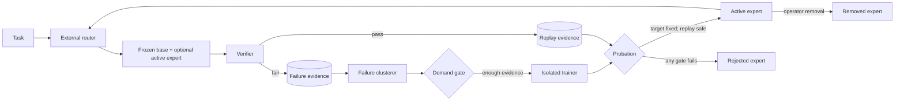

# Architecture and invariants

Grove separates the learning mechanism from the evidence and deployment control plane.



## Component ownership

| Component | Owns | Must not own |
|---|---|---|
| `GroveRuntime` | live route, generation, verification, evidence capture | training or admission |
| `GroveStore` | durable state and audit events | model behavior |
| `ProfileRouter` | selection among active experts | expert mutation |
| `SleepCycle` | demand/probation policy and state transitions | backend-specific training |
| `ExpertTrainer` | creation of one isolated candidate artifact | deployment or active-state mutation |
| `LongitudinalBenchmark` | stable checkpoint metrics | training data selection |

## Safety invariants

1. **The base is outside Grove's mutation surface.** The backend may load it, but the lifecycle never exposes a base-weight update operation.
2. **Candidate is not active.** The store records it as `candidate`; only the probation gate can transition it to `active`.
3. **Only deployed active experts route.** Runtime intersects lifecycle-active experts with the current deployment manifest. An active expert can be temporarily unplugged by rollback; rejected and removed artifacts remain auditable but cannot receive traffic.
4. **Probation tests the router, not just the expert.** Target tasks force the candidate to measure its competence. Replay tasks use the full shadow expert pool to expose misrouting regressions.
5. **Only verifier-backed examples train.** The demand gate requires stored corrections. A failure without a correction remains evidence, not training truth.
6. **Resolution follows proof.** Grove marks only failures the candidate actually fixed as resolved.
7. **Removal is state, not deletion.** The artifact and its birth/probation evidence remain in the ledger after it is unplugged.
8. **Evaluation is non-learning.** Benchmark and probation attempts are ephemeral and cannot accidentally create new training failures.

## State machine

```text
candidate -> active -> removed
    |
    +-----> rejected
```

There is deliberately no `rejected -> active` or `removed -> active` shortcut. Retraining or reconsideration creates a new candidate with new evidence.

## Current routing design

The base model is dense; there is no internal MoE router, and Grove's router does not sit in front of one. "Expert" here means a standalone LoRA adapter, not an MoE feed-forward sub-layer. The router is an external dispatch layer in front of the model itself: one decision per request, attaching one admitted adapter or none, rather than per-token, per-layer expert mixing inside the forward pass. See the README's "Routing: not MoE" section for the full contrast.

The reference router is external and profile-based. Each expert declares narrow tags, keywords, and optionally a token vector. This is deliberately interpretable and reversible. A real embedding classifier can replace it behind the same `route(task, experts)` seam, but its proposed update still has to survive routed replay.

## Data boundary

The SQLite store contains task prompts, expected corrections, model responses, and verifier detail. Production deployments should treat it as sensitive workload data: encrypt it at rest, apply retention rules, redact secrets before capture, and keep train/eval cohort membership immutable.
