# Grove visual guide

These Mermaid diagrams summarize the architecture, experimental history, results, evidence, and remaining research work. Sections 1–3 describe the system; sections 4–8 describe the first real experiment (2026-07-31) and its independent verification; sections 9–12 describe the sealed experiments EXP-002 through EXP-005 (2026-08-08 through 2026-08-11); section 13 maps the open questions. The complete quantitative records are `EXPERIMENT_REPORT_2026-07-31.md`, `VERIFICATION_2026-08-01.md`, `EXPERIMENT_PROTOCOL.md`, and the dated notes in `../research/`.

## 1. Two-machine system and trust boundaries

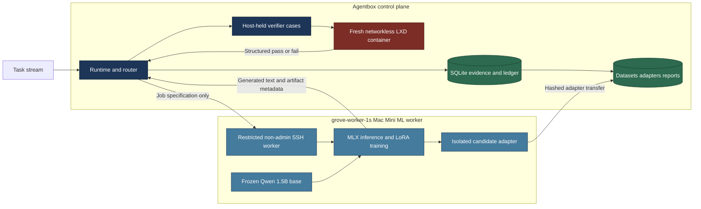

The model output is untrusted. It crosses back to Agentbox as text and is executed only inside the disposable LXD boundary. Hidden expected values never go to the Mac or into model prompts.

## 2. Verified expert-growth lifecycle

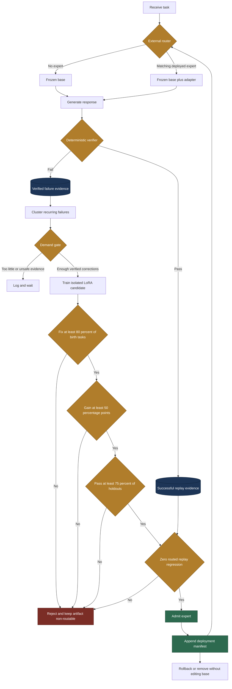

Rejected candidates cannot be switched to active later. A reconsideration is a new candidate with a new artifact and a new probation decision.

## 3. Data isolation and evidence flow

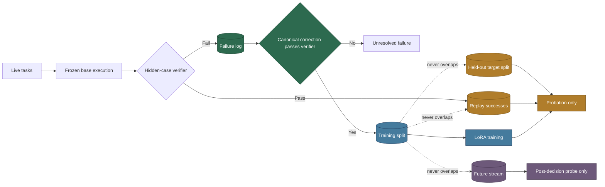

Final split sizes were 20 training prompts, 4 held-out targets, 4 regressions, and 2 future tasks. Only accepted corrections can receive the training role.

## 4. Four real candidate attempts

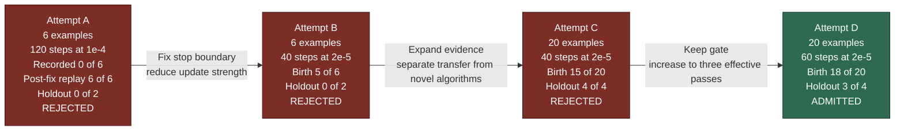

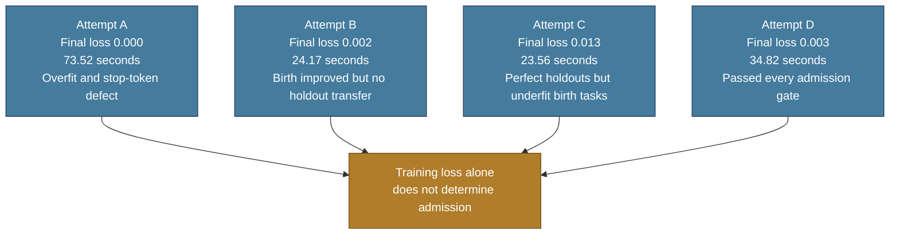

Attempts A/B and C/D used different workload designs, so their holdout numbers are not directly comparable. The change is part of the recorded experiment history.

## 5. Final benchmark result

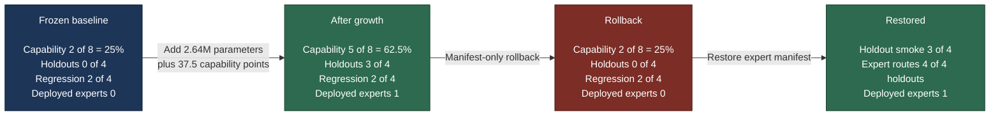

The regression result stayed at 2/4 because the base already failed the other two tasks. The supported claim is zero measured loss on known successes, not perfect general Python performance.

## 6. What the final expert learned and did not learn

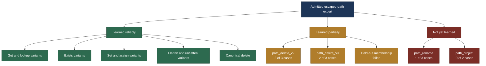

The residual corrected failures form a specific deletion/pruning cluster. The future failures show that learning escaped parsing does not automatically produce new path algorithms.

## 7. Append-only deployment history

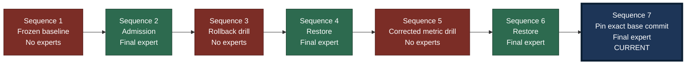

Rollback appends a new manifest; it does not erase history or mutate adapter weights. Sequence 5 corrected a reporting defect where growth cost counted lifecycle-active rather than currently deployed experts.

## 8. Evidence and artifact lineage

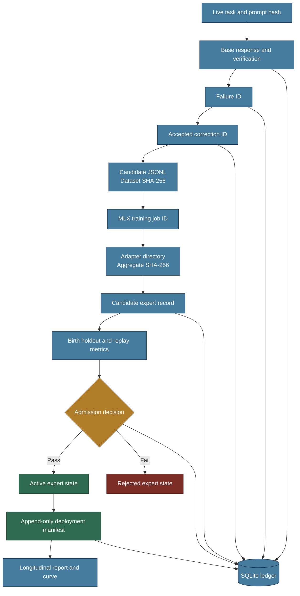

This lineage makes every deployed expert traceable to the exact failures, corrections, dataset, training job, artifact, probation metrics, and deployment decision that created it.

## 9. Sealed-experiment history and outcomes

Everything after the first experiment ran under sealed, predeclared specs (`../experiments/`) graded by `scripts/check_experiment_spec.py`. A run either passes, fails a named rule, or is refused as unusable (exit 2) — a refusal binds the run to its declaration but grades nothing.

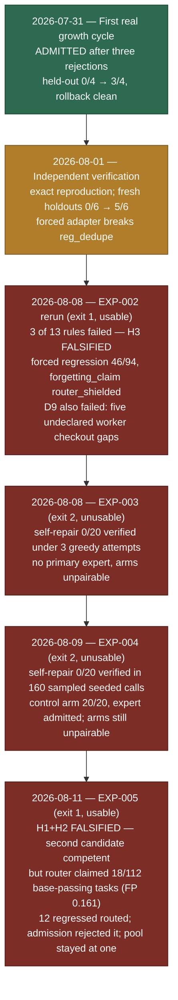

The first EXP-002 attempt (2026-08-08 morning) is also on record: every LXD launch timed out, live capture graded 0/123, and the run measured nothing (`../research/2026-08-08-exp002-run.md`). The rerun the same day had healthy infrastructure and produced the falsification.

## 10. EXP-002: routed versus forced replay

The question H3 asked: does the adapter itself preserve prior competence, or does the router merely keep prior traffic away from it?

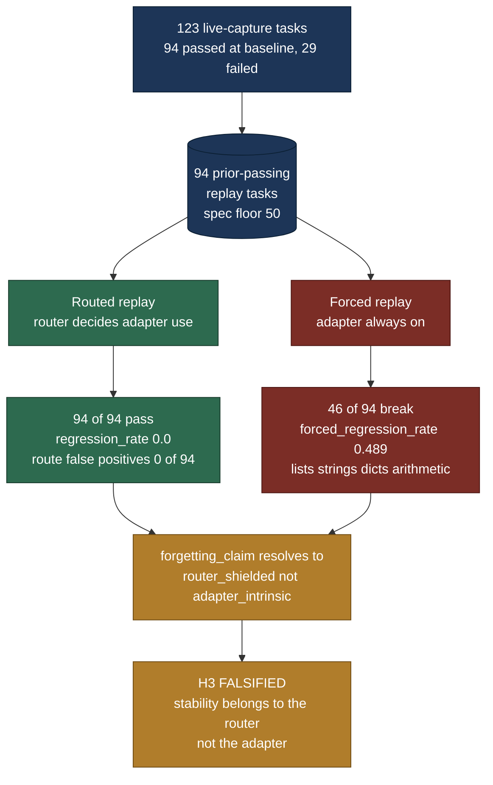

This is a scientific result, not a bug: the deployed system's zero regression is real, but it depends on router precision (measured 1.0 on this single-expert probe) holding as experts multiply. No threshold was loosened to accommodate the failure.

## 11. EXP-003 and EXP-004: the self-repair zero

Both experiments asked whether the model can supply its own verified corrections instead of human-written canonical ones — the decisive input for a self-improving loop. Both arms of each run captured the same 20 verified `escaped_path` training failures.

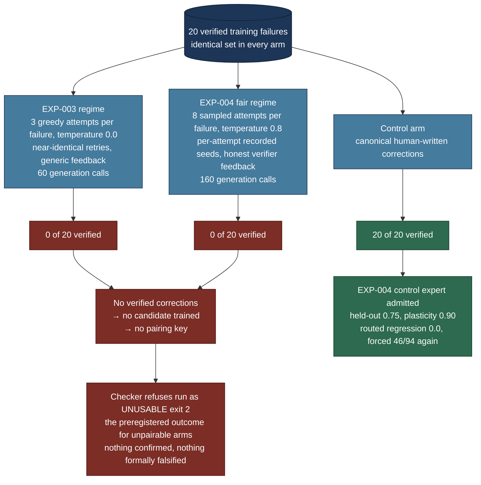

Zero successes in 160 roughly independent sampled attempts bounds the per-attempt repair probability at roughly 1.9% (95%, rule of three) — below the ~3.5% needed to reach the sealed 0.25 verified-rate bar under 8 attempts. The rejections were substantive, not infrastructural: exit-status failures, hidden-case failures, one malformed result. The measurement stands even though the A/B comparison could not be graded.

## 12. EXP-005: the second cycle and the router over-claim

The question: can a second expert grow on a new same-domain family (`path_restructure`) while the first stays deployed? The candidate was competent; the tag/keyword router was not precise enough to deploy it.

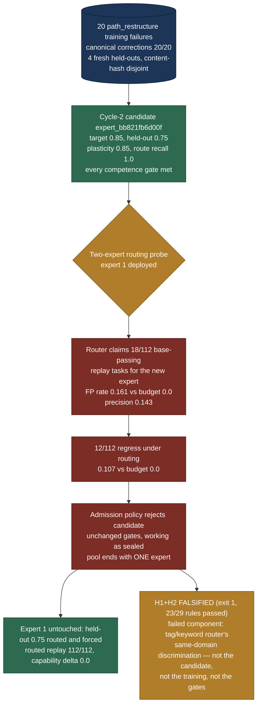

The safety property held (nothing regressed in deployment; the bad pairing was refused); the growth property did not (the pool has still never held two experts). The transfer diagnostic was also negative: `path_project` 0.0, `path_rename` 0.33, both misrouted to expert 1. Full record: `../research/2026-08-11-exp005-second-cycle.md`.

## 13. Open questions after EXP-005

Ranked by how much each threatens the core claim; details in `../PLAN.md` and the README.

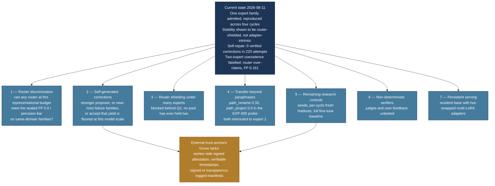

The 50-task replay floor that an earlier version of this diagram listed as future work has been met and measured (94 prior-passing tasks): routed replay is stable and forced replay is falsified. Replay stability is now a result, not a gap.
